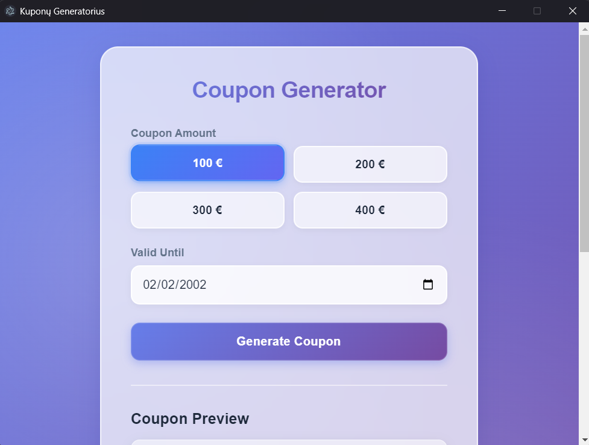
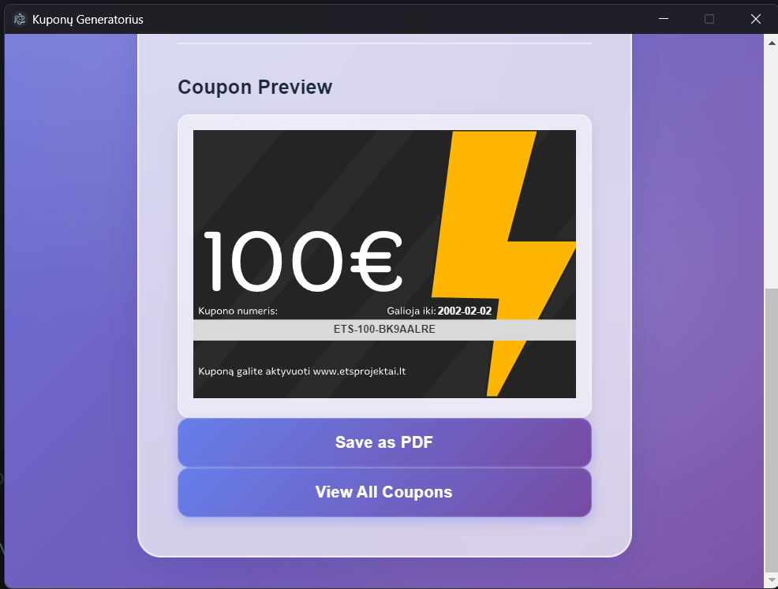

# 🎟️ Coupon Generator - Electron App

A beautiful, modern desktop application for generating and managing promotional coupons with PDF export functionality. Built with Electron and featuring a premium glassmorphism UI design.



## ✨ Features

- **🎨 Premium UI Design** - Modern glassmorphism interface with smooth animations and gradient effects
- **💰 Multiple Coupon Amounts** - Generate coupons for 100€, 200€, 300€, or 400€
- **📅 Custom Validity Dates** - Set expiration dates for each coupon
- **🔐 Unique Coupon Codes** - Automatically generates secure, unique 12-character alphanumeric codes
- **👁️ Live Preview** - See your coupon design before saving
- **📄 PDF Export** - Save coupons as high-quality PDF files
- **💾 Coupon Management** - View all generated coupons with status tracking (Active/Used)
- **🎯 SVG Template Integration** - Injects coupon data into SVG templates with precise positioning
- **📊 JSON Storage** - Persistent storage of all generated coupons

## 🖼️ Screenshots

### Main Interface


### Coupon Preview


## 🚀 Getting Started

### Prerequisites

- [Node.js](https://nodejs.org/) (v14 or higher)
- npm (comes with Node.js)

### Installation

1. Clone the repository:
```bash
git clone https://github.com/yourusername/coupon-gen-electron.git
cd coupon-gen-electron
```

2. Install dependencies:
```bash
npm install
```

3. Run the application:
```bash
npm start
```

## 📦 Building for Production

Package the application for Windows:

```bash
npm run package
```

This will create a distributable Windows application in the `dist` folder.

## 🛠️ Tech Stack

- **Electron** - Cross-platform desktop application framework
- **HTML5/CSS3** - Modern web technologies
- **JavaScript** - Application logic
- **SVG** - Scalable vector graphics for coupon design
- **PDF Generation** - Built-in PDF export functionality

## 📁 Project Structure

```
coupon-gen-electron/
├── main.js              # Electron main process
├── renderer.js          # Frontend logic
├── preload.js          # Secure IPC bridge
├── index.html          # Main UI
├── styles.css          # Glassmorphism styling
├── coupons.json        # Coupon database
├── pic/                # SVG templates
├── screenshot/         # App screenshots
└── package.json        # Project configuration
```

## 🔧 How It Works

1. **Coupon Generation**
   - User selects amount and validity date
   - System generates unique 12-character alphanumeric code
   - Code and date are injected into SVG template at coordinates (x=437, y=457) and (x=437, y=500)
   - Coupon data is saved to `coupons.json`

2. **PDF Export**
   - SVG is converted to PDF format
   - User selects save location via native dialog
   - High-quality PDF is generated and saved

3. **Coupon Management**
   - All coupons stored in JSON database
   - View list of all generated coupons
   - Track coupon status (Active/Used)
   - Display creation date and validity period
